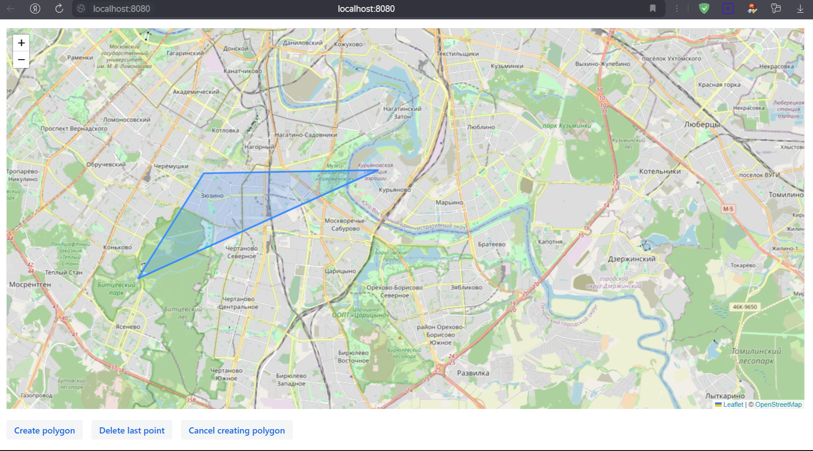

# Описание

</img>
</img>
</img>
</img>

</img>
Программа по заданным точкам выделяет полигон на карте и выводит координаты создавшегося полигона в консоль.

Укажите на карте точки затем нажмите "Create polygon".


### Компиляция и запуск

___1. Компиляция___
```
mvn clean install
```

___2. Запуск___

````
cd target

java -jar stupor-maps-0.0.1-SNAPSHOT.jar
````

После запуска в браузере перейдите на: http://localhost:8080